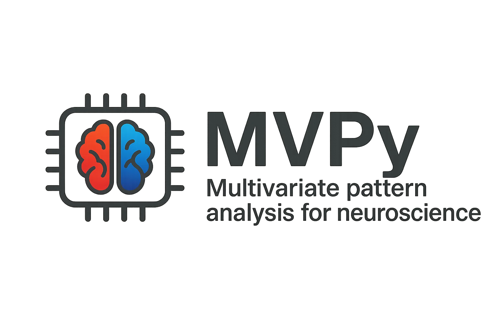

[](https://github.com/FabulousFabs/MVPy/actions)
[](https://github.com/FabulousFabs/MVPy/actions)


[](http://mvpy.tools/)

**MVPy** implements **m**ulti**v**ariate pattern analysis in **py**thon, with direct GPU support and easy-to-use coding patterns. Its target audience are neuroscientists.

The project started in 2024 when we found that our planned analyses were prohibitively expensive to run in existing neuroscience frameworks and we needed to find a way to put intensive multivariate computations on GPUs.

It is currently maintained by me, but new contributors are extremely welcome. 

**[Find the documentation here](http://mvpy.tools)**.

## How do I get started?
You can install MVPy directly from GitHub:

```bash
pip install git+https://github.com/FabulousFabs/MVPy.git
```

and get started immediately with familiar sklearn workflows:

```python
import torch
from mvpy.dataset import make_meeg_continuous
from mvpy.preprocessing import Scaler
from mvpy.estimators import TimeDelayed
from mvpy.crossvalidation import cross_val_score
from mvpy.model_selection import hierarchical_score, shapley_score
from sklearn.pipeline import make_pipeline

# create dataset of continuous stimuli between -0.25-1.75s
# X is of shape (n_trials, n_features, n_timepoints)
# y is of shape (n_trials, n_channels, n_timepoints)
device = 'cuda'
fs = 200
X, y = make_meeg_continuous(fs = fs, device = device)

# setup pipeline for estimation of multivariate temporal response functions
# ranging from 0.0-1.0s (causal in stimulus)
trf = make_pipeline(
    Scaler().to_torch(),
    TimeDelayed(
        -1.0, 0.0, fs, 
        alphas = torch.logspace(-5, 5, 20, device = device)
    )
)

# maybe we want to know how well the full model performs?
# scores are now of shape (n_folds, n_channels, n_timepoints)
validator, scores = cross_val_score(trf, X, y, verbose = True)

# maybe we want to know how each predictor/combination performs?
# scores are now of shape (n_sets, n_folds, n_channels, n_timepoints)
hierarchical, scores = hierarchical_score(trf, X, y, verbose = True)

# maybe we want to know the share of unique variance each predictor explains?
# scores are now of shape (n_permutations, n_sets, n_folds, n_channels, n_timepoints)
shapley, scores = shapley_score(trf, X, y, verbose = True)
```

Find examples and more information here in the **[documentation](http://mvpy.tools)**.

## Is it really worth it?
...